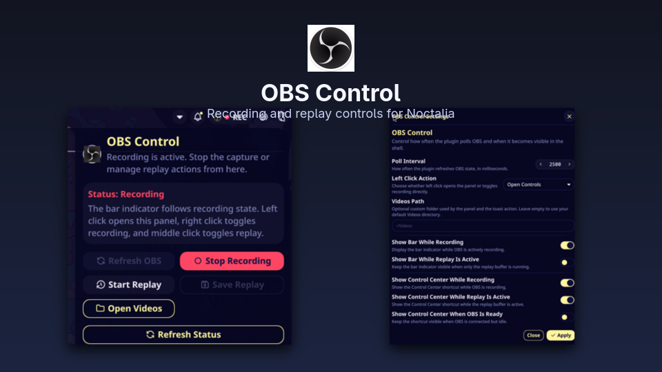

# OBS Control

OBS Studio controls for Noctalia Shell. The plugin adds a bar indicator, an optional Control Center shortcut, and a panel for recording and replay actions.

## Requirements

- `obs-studio`
- OBS WebSocket enabled in OBS
- `node` available in `PATH`
- a Node.js runtime with built-in `WebSocket` support, such as current Node.js releases

## Installation

Open Noctalia Settings, go to `Plugins`, search for `OBS Control` in `Available`, and install it.

After enabling it, add `plugin:obs-control` to your bar or Control Center layout if you want the widget visible there.

## Features

- bar indicator for recording and replay states
- optional Control Center shortcut when OBS is active
- panel with launch, refresh, recording, replay, save, and open-videos actions
- elapsed recording timer in the panel
- configurable polling interval, left-click behavior, and visibility rules
- native Noctalia toast actions after recording or replay saves

## Keyboard Shortcuts

This plugin uses Noctalia IPC for compositor keybinds and external triggers.

Use Noctalia IPC directly from your compositor:

```bash
qs -c noctalia-shell ipc call plugin:obs-control togglePanel
qs -c noctalia-shell ipc call plugin:obs-control toggleRecord
qs -c noctalia-shell ipc call plugin:obs-control toggleReplay
qs -c noctalia-shell ipc call plugin:obs-control saveReplay
```

## Troubleshooting

- If OBS is running but the plugin says WebSocket control is unavailable, restart OBS once after enabling obs-websocket.
- If actions do nothing, test `qs -c noctalia-shell ipc call plugin:obs-control refreshStatus` from a terminal in your session.
- If the plugin fails to talk to OBS, confirm `node` is in `PATH` for the graphical session as well as your shell.

## Screenshots




